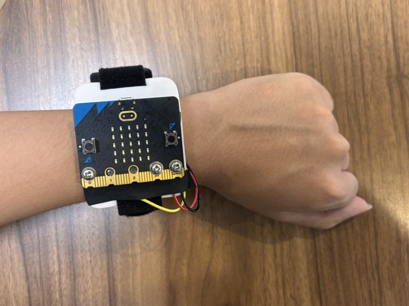

# 環境音シーン認識・安全アシストデバイス

**周囲の音を常時聞き取り、危険を知らせる音だけをエッジAIが聞き分けて、光と振動で伝えるウェアラブル機器**

TRONプログラミングコンテスト2026 / RTOSアプリケーション部門（学生部門）応募作品
micro:bit v2 + μT-Kernel 3.0

---

## これは何か

難聴・聴覚障害のある方や、ノイズキャンセリングヘッドホンで周囲の音が聞こえない方は、
**緊急車両のサイレンやクラクションに気づけない**という日常的な危険にさらされています。

本作品は、手のひらサイズのマイコンボード単体で周囲の音を聞き続け、
**緊急車両サイレン / クラクション / その他** を機械学習で判別し、
危険音を検知したときだけ LED と振動で知らせます。

- **クラウドに一切接続しません。** 音声が外部へ出ないためプライバシーが完全に保たれ、通信費も電波も不要です
- **電池で動きます。** 腕に着けて持ち歩けます
- **音の大きさではなく、音の種類で判別します。** 音量が変わっても判定がぶれず、マイクのゲイン調整も要りません（ただし、周りの雑音に埋もれるほど小さな音には反応しにくいことが分かっています。[評価結果](docs/EVALUATION.md#5-既知の弱点)を参照）

---

## 試すときのお願い（音は大きめに）

電池を入れてスイッチをONにすると、そのまま動き始めます。
スマートフォンなどでサイレンやクラクションの音を聞かせるときは、次のようにしてください。

1. **音量は大きめ（最大に近い音量）にしてください。**
   小さな音は周りの雑音に埋もれてしまい、「その他」と判定されることがあります。
2. **スピーカーを本体のマイクに近づけてください。**
   マイクは、micro:bit 表面のロゴの右横にある小さな穴です。
3. **2〜3秒以上続けて鳴らしてください。**
   1秒ごとに判定しており、サイレンは2回続けて判定したときに知らせます。
   0.3秒ほどの短い「プッ」という音には、反応しないことがあります。

反応すると、LEDの点灯と振動で約3秒間知らせます（下の表を参照）。

---

## 動作のようす

**デモ動画（約50秒）：https://youtu.be/pyXOdZmFe1g**

**紹介資料（スライド）：[docs/slides.pdf](docs/slides.pdf)**



```
=> other conf=652 (340ms) run=3
=> SIREN conf=882 (340ms) run=2  *** ALERT ***   ← LED点灯・振動
=> SIREN conf=908 (340ms) run=7  *** ALERT ***
```

| 検知した音 | 通知 |
|---|---|
| 緊急車両サイレン | LEDマトリクス 一番上の段が点灯 ＋ 長い振動2回 |
| クラクション | LEDマトリクス 真ん中の段が点灯 ＋ 短い振動3回 |
| その他の音・静音 | 通知しない |

---

## なぜ RTOS が必要なのか

**音は待ってくれません。** 推論している間に録音が止まれば、その間に鳴った音は永久に失われます。
一方で推論は約350ms（実測340〜380ms）かかる重い処理です。この二つを両立させるのが本作品の技術的な核心です。

μT-Kernel 3.0 の優先度付きマルチタスクで、録音・推論・通知を独立したタスクに分離しました。

```
┌─────────────────────────────────────────────────────────────┐
│ T_audio   優先度 2 （最優先）                                │
│   SAADC + EasyDMA のピンポンバッファで 8kHz 連続サンプリング  │
│   片面(1秒)が埋まった瞬間に次の面へ切り替え → 空白は最大約2ms  │
│   埋まった面をイベントフラグで T_infer へ通知                 │
└───────────────────────┬─────────────────────────────────────┘
                        │ tk_set_flg（イベントフラグ）
                        ▼
┌─────────────────────────────────────────────────────────────┐
│ T_infer   優先度 4 （最低）                                  │
│   メルスペクトログラム → CNN で3クラス推論（約350ms）         │
│   重い処理だが優先度が低いので、録音を妨げない                 │
│   結果をメッセージバッファで T_notify へ送る                  │
└───────────────────────┬─────────────────────────────────────┘
                        │ tk_snd_mbf（メッセージバッファ）
                        ▼
┌─────────────────────────────────────────────────────────────┐
│ T_notify  優先度 3                                           │
│   後処理: サイレンは確信度60%以上が2回連続、                  │
│           クラクション(短い音)は確信度70%以上なら1回で発報   │
│   → 単発の誤判定では光らない（誤報を抑制）                    │
│   LED点灯 ＋ 振動モーター駆動、3秒後に自動解除                │
└─────────────────────────────────────────────────────────────┘
```

**優先度設計の意図**：一番重い推論タスクを一番低い優先度に置いています。
T_audio は普段 `tk_dly_tsk` で眠って CPU を T_infer に譲り、DMA が1秒ぶんを
埋め終わった瞬間だけ起きて次のバッファへ切り替えます。
これにより **CPU の約35%を推論に使いながら、推論中も録音を続けられる** 構成になっています（面を切り替えるときにできる空白は最大約2ms）。

---

## 信号処理と機械学習

```
内蔵MEMSマイク(アナログ)
  → SAADC 12bit / 8kHz / EasyDMA        … ドライバは自作（キットに作例なし）
  → DC除去 → RMS正規化                   … ★音量に依存しなくする
  → FFT 512点 / ホップ 256
  → メルフィルタバンク 32帯域(HTK式)
  → 対数メルスペクトログラム 32×30 = 960次元
  → 標準化
  → 小型CNN (Conv 8-16-32 + GAP + Dense) 7,043パラメータ
  → 3クラスの確率
```

### 工夫した点：RMS正規化によるレベル不変化

当初は固定ゲインで int16 を float に変換していましたが、
**マイクのゲインや音源との距離が変わると対数メルの分布ごとズレてしまい、
サイレンをクラクションと誤判定する**問題が起きました。

そこで **1秒窓ごとに DC を除去し、RMS を基準値に揃えてから**特徴量を作るようにしました。
これにより入力の絶対音量が結果に影響しなくなり、**ゲインの手動較正が原理的に不要**になりました。

実測で、同じ録音の振幅を **0.1 倍〜10 倍**に変えて入力しても、出力確率はほぼ一致します
（詳細は [docs/EVALUATION.md](docs/EVALUATION.md)）。

### 学習データ

| 出典 | 用途 |
|---|---|
| ESC-50 | サイレン / クラクション / その他 |
| UrbanSound8K | サイレン 929、クラクション 429、その他 400クリップ |
| OtoLogic（CC BY 4.0） | **日本の**救急車・消防車・パトカーのサイレン 42本 |
| DOVA-SYNDROME | **日本の**救急車のサイレン 1本 |
| **実機録音** | micro:bit の内蔵マイクで録音した 67本 / 91秒 |

公開データセットだけで学習すると、欧米のサイレン（日本と音程が違う）に偏り、
かつ実機マイクの特性と合いません。そこで **実機のマイクで録音したデータを学習に加え**、
雑音拡張を厚くして重みを持たせています。

> 音声データそのものは再配布条件があるためリポジトリには含めていません。
> 出典は [CREDITS.md](CREDITS.md) に記載しています。

---

## 実測性能

| 項目 | 実測値 |
|---|---|
| 推論時間 | **約350 ms**（実測340〜380ms）/ 1秒窓（CPU使用率 約35%） |
| RAM（静的に確保する領域） | **約103 KB** / 128 KB（bss 102KB＋data 1KB） |
| Flash | **85 KB** / 512 KB |
| モデルサイズ | 7,043 パラメータ |
| Python↔C 実装の一致 | 最大誤差 4.77e-7 |

### 分類精度（5分割交差検証・ファイル単位で分割）

| 評価データ | 正解率 |
|---|---|
| **実機マイクで録音したデータ** | **90.1 %** |
| 公開データセット・クリーン | 87.2 % |
| 公開データセット・雑音入り(SNR 5dB) | 82.5 % |

**実機データでの誤報はゼロでした。**（「その他」47窓すべてを正しく「その他」と判定、再現率 1.000）
また「サイレン」と判定したものは100%が本当にサイレンでした（適合率 1.000）。

安全機器にとって最も重要なのは「危険でない音を危険と言わないこと」です。
鳴っていないのに通知する機器は使う人に無視され、本当の危険時にも気づいてもらえなくなります。

詳細は [docs/EVALUATION.md](docs/EVALUATION.md) を参照してください。

---

## ドキュメント

| 文書 | 内容 |
|---|---|
| [docs/BUILD.md](docs/BUILD.md) | **ビルド・書き込み・動作手順**（審査用・ここから始めてください） |
| [docs/ARCHITECTURE.md](docs/ARCHITECTURE.md) | タスク構成・信号処理・ファイル構成の詳細 |
| [docs/EVALUATION.md](docs/EVALUATION.md) | 評価方法と結果（混同行列・実機実測値） |
| [CREDITS.md](CREDITS.md) | 使用したデータセットと音源の出典 |

## ディレクトリ構成

```
firmware/    micro:bit 上で動くソース（μT-Kernel アプリ）
src/         Python: 学習パイプライン（前処理・学習・重み書き出し・検証）
c_impl/      C の参照実装（PC上で Keras と数値一致を検証するため）
tools/       実機録音ツール・録音品質チェックツール
models/      学習済みモデルと正規化パラメータ
data/        データセット置き場（音声そのものは非公開）
```

---

## ライセンス・注意

- 本リポジトリのソースコードは応募者が作成したもので、[MITライセンス](LICENSE)で公開しています
- μT-Kernel 3.0 本体および micro:bit 向け BSP は
  「IoTエッジノード実践キット/micro:bit」（パーソナルメディア株式会社）付属のものを使用しています。
  再配布はできないため本リポジトリには含まれません（[docs/BUILD.md](docs/BUILD.md) に配置方法を記載）
- 学習に使用した音声データの出典とライセンスは [CREDITS.md](CREDITS.md) を参照してください
